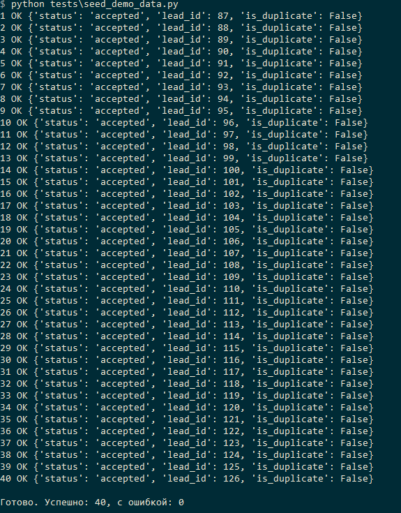
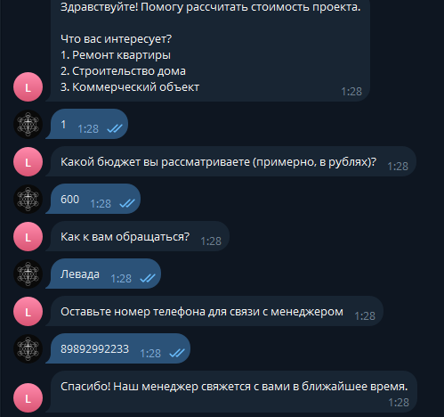
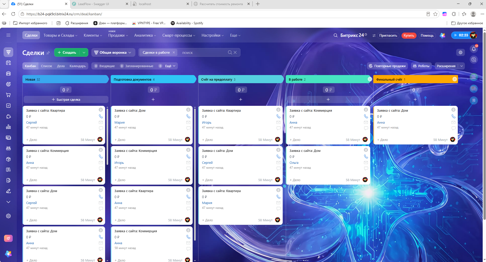
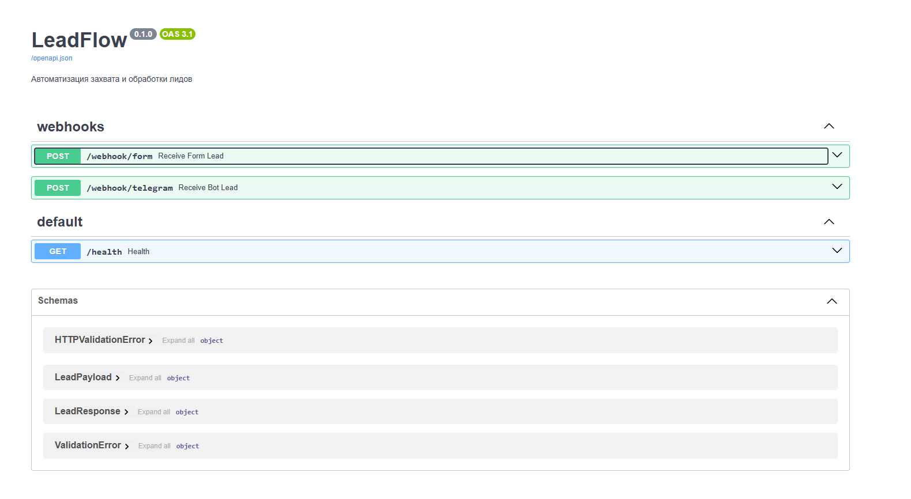
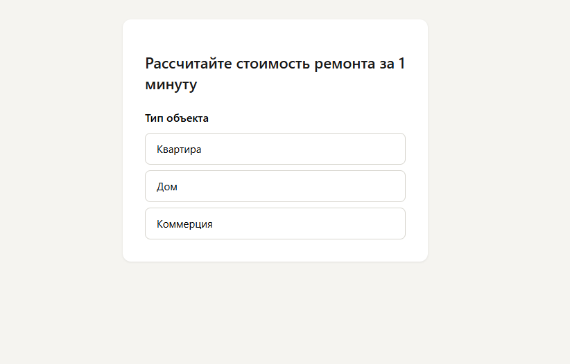

# LeadFlow — автоматизация захвата и обработки лидов

Пайплайн для строительной компании: от квиза на лендинге и Telegram-бота
до CRM (Bitrix24) и дашборда сквозной аналитики. Портфолио-проект под задачи
автоматизации маркетинга и продаж.

## Проблема

Лиды из рекламы теряются между формами на сайте, мессенджерами и CRM: часть
заявок не долетает до менеджеров, UTM-метки теряются на полпути, а понять,
какой канал реально приносит сделки, невозможно без сквозной аналитики.

## Что делает проект

- **Захват лидов**: квиз на лендинге (HTML/JS) и Telegram-бот первичной квалификации
- **Бэкенд** (FastAPI): приём вебхуков, валидация, дедупликация лидов по телефону
- **Интеграция с Bitrix24**: создание лидов через REST API с ретраями при сбоях
  (экспоненциальный backoff, до 3 попыток)
- **Аналитика**: дашборд на Streamlit — воронка по каналам и UTM-меткам

## Архитектура

```
Лендинг с квизом ──┐
                    ├──▶ Бэкенд (FastAPI) ──▶ SQLite/Postgres ──▶ Дашборд (Streamlit)
Telegram-бот ───────┘            │
                                  └──▶ Bitrix24 CRM (REST API)
```

Бэкенд и отправка в Bitrix24 разделены: если Bitrix24 недоступен, лид всё
равно сохраняется локально и не теряется — отправка ретраится в фоне.

## Стек

Python 3.11+, FastAPI, aiogram 3, SQLite (по умолчанию) / PostgreSQL,
Streamlit, Plotly, HTML/CSS/JS, httpx

## Структура репозитория

```
leadflow/
├── app/                  # бэкенд FastAPI
│   ├── main.py           # точка входа
│   ├── database.py       # подключение к БД, автосоздание таблиц
│   ├── models/           # Pydantic-модели и валидация
│   ├── routers/          # webhook-эндпоинты
│   └── services/         # дедупликация, Bitrix24-клиент
├── bot/                  # Telegram-бот квалификации (aiogram)
├── landing/              # лендинг с квизом (HTML/JS), захват UTM
├── dashboard/            # аналитика на Streamlit
├── tests/                # тесты + генератор демо-данных
├── requirements.txt
└── .env.example
```

## Как запустить локально

```bash
git clone <this-repo>
cd leadflow

python -m venv venv
venv\Scripts\activate          # Windows
# source venv/bin/activate     # macOS/Linux

pip install -r requirements.txt
copy .env.example .env         # Windows
# cp .env.example .env         # macOS/Linux
```

По умолчанию используется SQLite — отдельный файл `leadflow.db`, ничего
дополнительно ставить не нужно. Для продакшена в `.env` можно указать
`DATABASE_URL=postgresql://...` — код работает с обеими СУБД без изменений.

Дальше — в трёх отдельных окнах терминала:

```bash
# бэкенд
uvicorn app.main:app --reload --port 8000

# Telegram-бот (нужен BOT_TOKEN в .env, получить у @BotFather)
python bot/bot.py

# дашборд (нужны данные — см. ниже про демо-данные)
streamlit run dashboard/app.py
```

Лендинг — просто открыть `landing/index.html` в браузере.

## Как получить тестовый Bitrix24

1. Зарегистрировать бесплатный портал на bitrix24.ru
2. Перейти в раздел "Разработчикам" → "Другое" → создать **входящий** вебхук
3. Отметить права доступа к разделу CRM
4. Скопировать URL вебхука в `.env` как `BITRIX_WEBHOOK_URL`

## Наполнить дашборд демо-данными

Пока не подключены реальные лиды, дашборд можно наполнить синтетическими
данными:

```bash
python tests/seed_demo_data.py
```

Скрипт отправит 40 тестовых заявок с разными UTM-метками через тот же
эндпоинт `/webhook/form`, каким пользуется настоящий лендинг.

## Проверка работоспособности

- `http://127.0.0.1:8000/health` — бэкенд отвечает `{"status": "ok"}`
- `http://127.0.0.1:8000/docs` — интерактивная документация API (Swagger),
  можно отправлять тестовые запросы прямо из браузера
- `http://localhost:8501` — дашборд (открывается автоматически при запуске Streamlit)

## Демонстрация











## Что можно добавить дальше

- Скоринг лидов на основе ML вместо правил
- Уведомления менеджеру, если сделка не тронута N часов
- A/B-тестирование вариантов квиза
- Обогащение лидов данными компании (для B2B-сегмента)
- Миграции через Alembic вместо автосоздания таблиц

## Автор

<!-- имя, ссылка на LinkedIn/Telegram, контакты -->
